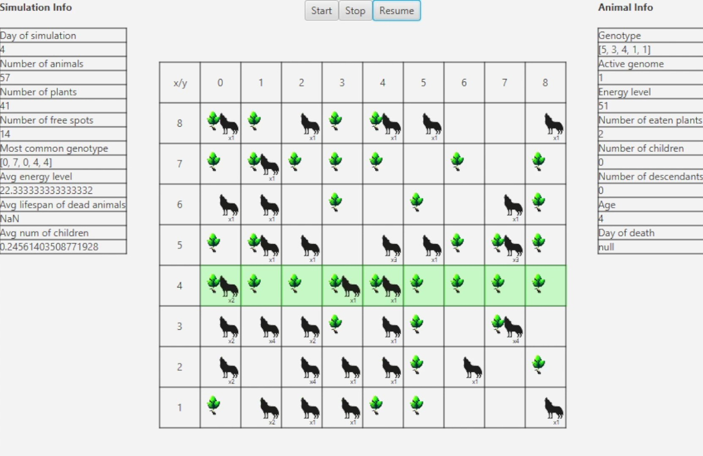
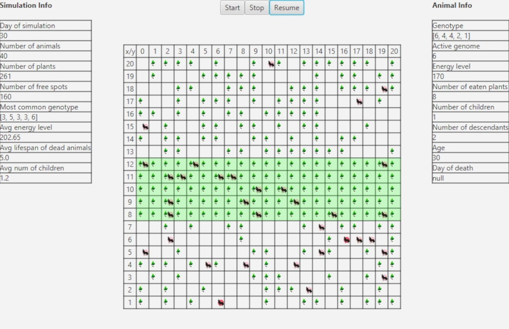
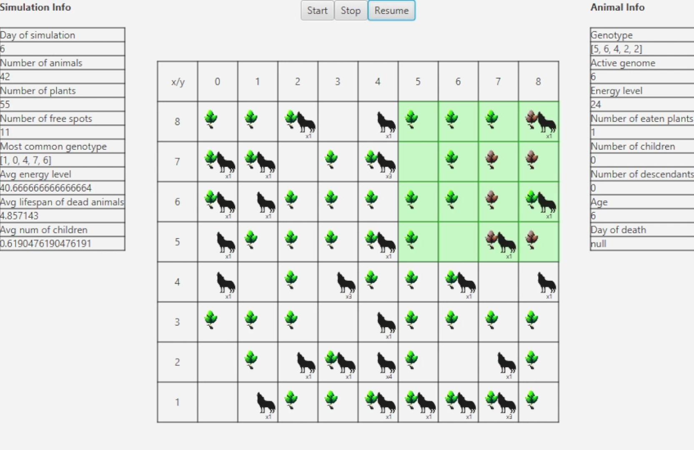
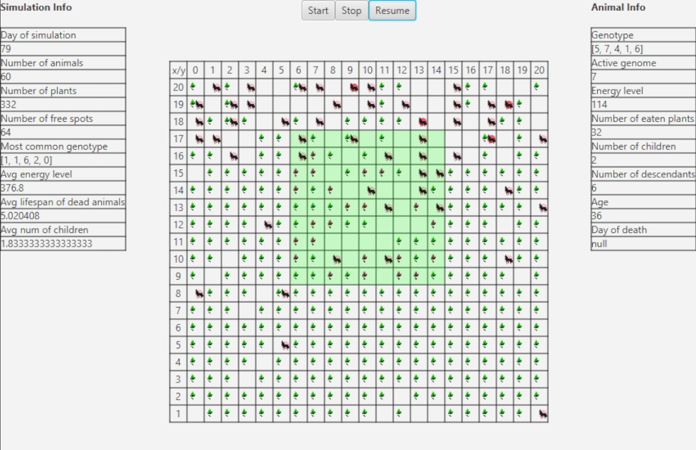

# Darwin World - simulating life of animals

(Veteratian wolfs in this case :wink:)

### Project at the end of the Object-Oriented-Programming course.

## App Details:

### Map Version: Equator

The following images depict map versions with the equator positioned at the center. The equator is a favorable location for plant growth.

    
    

### Map Version: Poisonous

The following images depict a map with a poisonous area. In the poisonous area, some of the growing plants are poisonous (marked in red) and they take energy from animals after they eat them.

    
    

---

#### App in action:

    

## Design patterns:  

- observer (we used observer to notify UI about changes in the simulation, world and animals)
